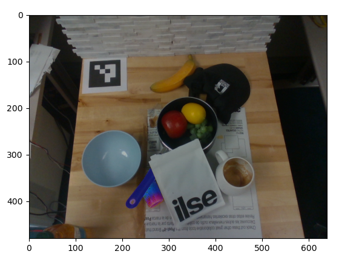

# OWLSAM2
This is a lightweight repository to perform open-vocabulary object detection and segmentation using [OWLv2](https://huggingface.co/docs/transformers/en/model_doc/owlv2) and [SAM2](https://github.com/facebookresearch/sam2).
This repository has only three core dependencies, [PyTorch](https://pytorch.org/get-started/locally/), [Transformers](https://huggingface.co/docs/transformers/en/installation), and [SciPy](https://scipy.org/install/) plus [OpenCV](https://pypi.org/project/opencv-python/) and [MatPlotLib](https://matplotlib.org/stable/install/index.html) for visualization purposes only.

Here is an example of detecting and segmenting a partially occluded saucepan handle in a cluttered environment using the language tag "Saucepan handle".
<p align="center">
  
</p>

## Installation
This code has been tested with Python 3.10. The best way to install the dependencies for maximum compatibility is from their individual pages (linked above). The requirements.txt file provided is for PyTorch 2.6.0 with CUDA 12.4.

Install base dependencies
```
git clone https://github.com/MVerghese/OWLSAM2.git && cd OWLSAM2
pip install -r requirements.txt
```

Install SAM2. Note, SAM2 cannot be cloned to this repository, as you cannot import SAM2 from a Python file in the SAM2 parent directory. Clone and install SAM2 elsewhere.
```
cd ..
git clone https://github.com/facebookresearch/sam2.git && cd sam2
pip install -e .
```
## Setup
Download the SAM2 Checkpoints.
```
cd checkpoints && \
./download_ckpts.sh && \
cd ..
```
Update the SAM2_PATH variable (line 9 in OWL.py) to point to your sam checkpoint of choice. You can run the detector on an example image with
```
python OWL.py
```

## Disclaimer
I have no affiliation with the OWLv2 team or the SAM2 team. All credit belongs to the original authors of these works. I have found this detector to be useful for robot manipulation, but have not tested it in other domains.

